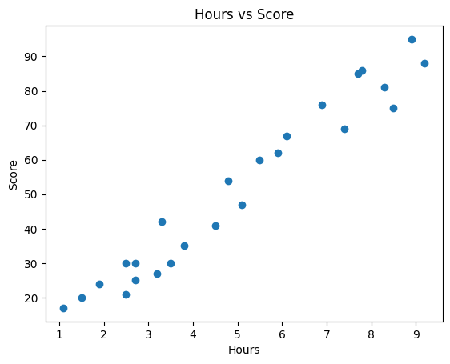
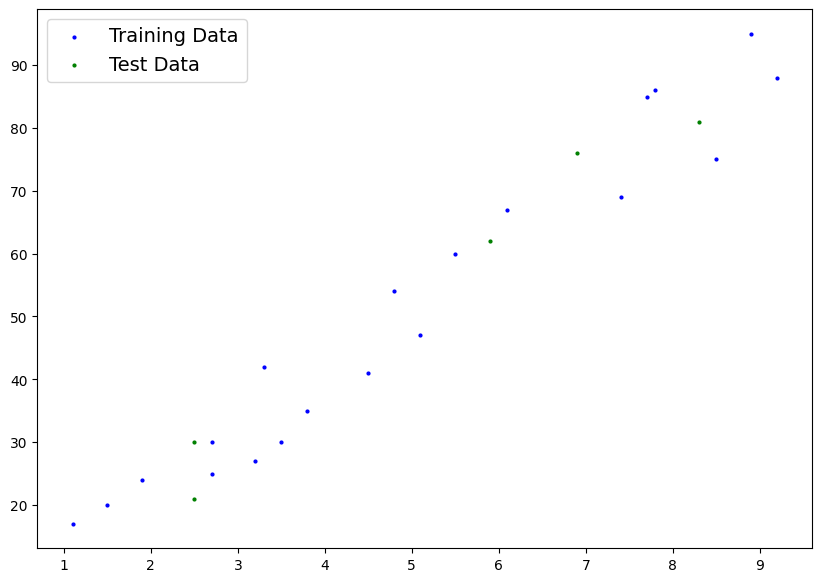
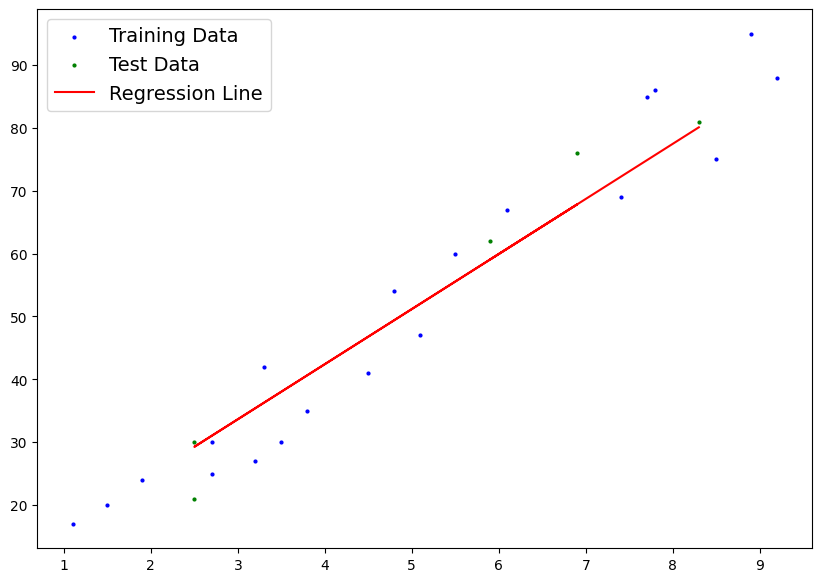
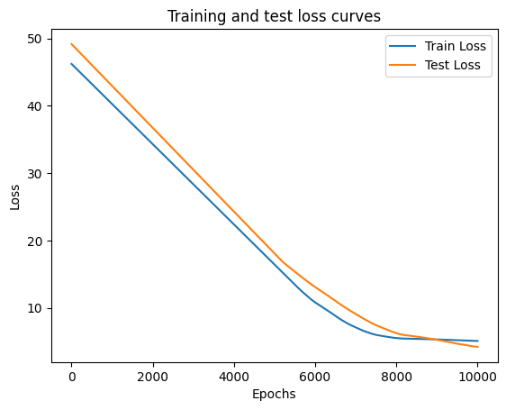

# Student score prediction through study hours

# Table of Contents
- [Objective](#Objective)
- [Data Source](#Data)
- [Procedure](#Procedure)
- [Usage](#Usage)

# Objective

This is a project that I have created as a part of a selection competetion for FossMec club. Through this process I have created a ML model using PyTorch that will predict the marks scored by the a student using the number of hours studied.

# Data
The dataset used for this project is synthetically generated. It can be found in [here](https://raw.githubusercontent.com/codewizard-2004/Student-Grades/main/Data/student_scores.csv)

# Procedure

**Exploratory Data Analysis**

1. Checking for null values.
2. Identifying and handling duplicates.
3. Exploring data types and dataset entries.
4. Providing a statistical summary of the data.
5. Visualizing the relationship between hours studied and scores.




**Model Training**
The model was trained using PyTorch with L1Loss function and ADAM optimizer. The data was split into train and test by the ratio 4:1 where the number of hours studied is taken as features and score is taken as label.

**Model Evaluation**
The performance of the model is evaluated using the R-squared (R2) score, which provides insights into how well the model fits the data. The R2 score ranges from 0 to 1, with a higher score indicating a better fit. In this project, the R2 score is 0.95, demonstrating the model's capability to predict scores based on study hours.






This loss curve indicate that the model is stablized

# Usage
The model was saved using pyTorch's save method which saves models in pickle format. It can be easily accessed using pyTorch's load method

**How to Load and Use the Saved Model**
After downloading the saved model file (student_scores_model.pth), you can load it in PyTorch and use it to make predictions. Follow the steps below:

1. Install PyTorch:
Make sure you have PyTorch installed in your environment. If not, you can install it using pip:

```python
pip install torch
```

2.Define the Model Architecture:
You need to define the same model architecture that was used to train the model. Here is the code to do that:
```python
import torch
import torch.nn as nn

class LinearRegressionModel_v0(nn.Module):
  def __init__(self):
    super().__init__()
    self.layer1 = nn.Linear(1,1)

  #Forward pass methof of our model
  def forward(self , x: torch.Tensor) -> torch.Tensor:
    return self.layer1(x)
model = LinearRegressionModel()
```

3.Load the Model's State Dictionary:
```python
# Load the state dictionary from the saved model file
model.load_state_dict(torch.load("student_scores_model.pth"))

# Set the model to evaluation mode
model.eval()
```

4.Make Predictions:
You can now use the loaded model to make predictions. For example, to predict the score for 9.5 hours of study:
```python
# Example: Predicting score for 9.5 hours of study
hours_tensor = torch.tensor([[9.5]])
predicted_score = model(hours_tensor)
print(f"Predicted score for 9.5 hours of study: {predicted_score.item():.2f}")
```
